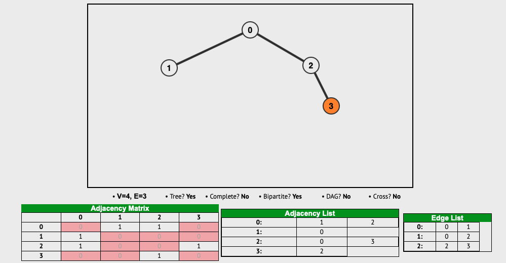
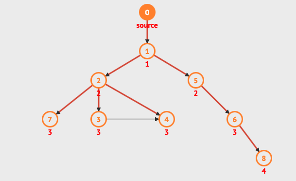
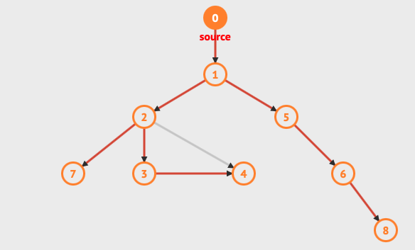

## Graph Algorithms in Python

Social networks, maps, routing networks that commonly use Graph data structure today. I especially work the **shortest path** in graph, the core algorithm for mapping technologies.

I coded undirected/unweighted graph algorithm in python. My example consists of 4 node and 3 edges. In the below picture you can see visualization of **graph.py** 

undirected/unweighted graph example 

Given a graph, i use the Depth-First-Search(DFS) and Breadh-First-Search algorithm to traverse the graph. I visualizated both algorithms. You can see implemented code on **traversal.py**

bfs graph example 

dfs graph example